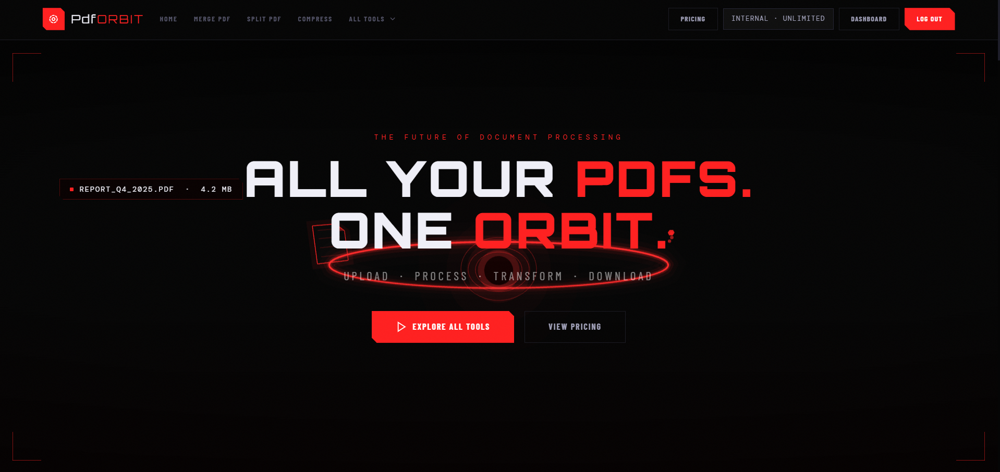
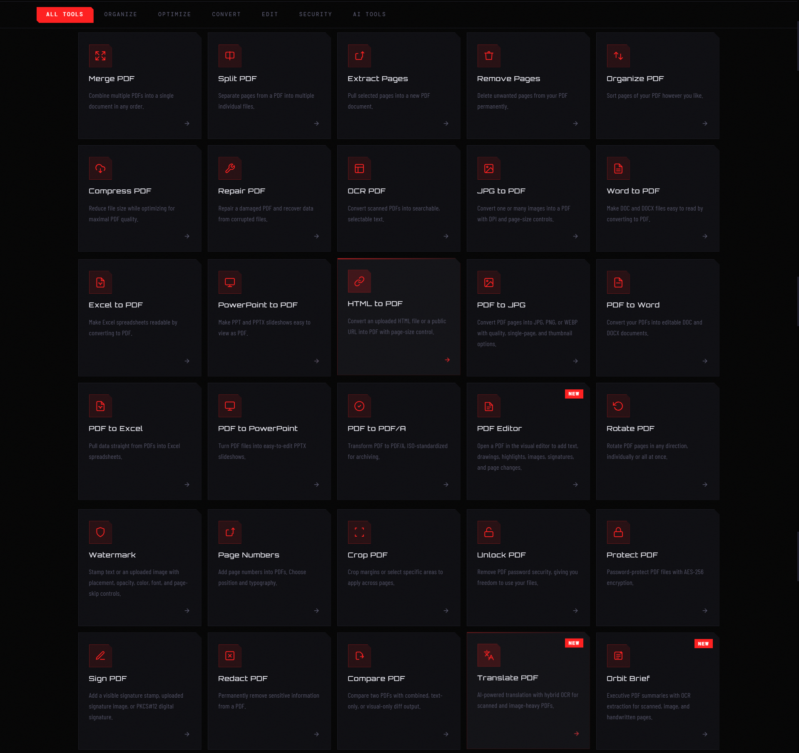
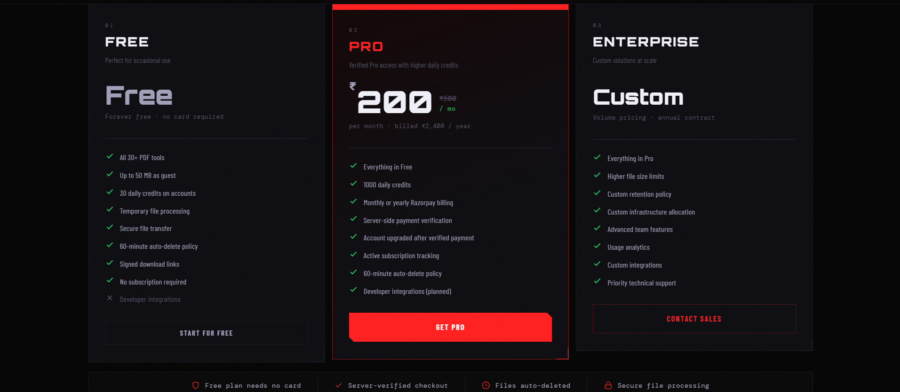

# PdfORBIT


Production-grade PDF SaaS built with Next.js, FastAPI, async workers, and Razorpay billing.

Live product:

- Website: https://pdforbit.app
- API: https://api.pdforbit.app

Maintainer:

- Deepak Rakshit
- LinkedIn: https://www.linkedin.com/in/deepakrakshit/

Career note:

- This project is being published publicly as part of an open-source portfolio.
- I am open to paid internship opportunities, engineering discussions, and serious product collaborations.

AI disclosure:

- This is an AI-assisted project.
- AI was used for implementation support, refactoring assistance, testing support, documentation drafting, and repository cleanup acceleration.
- Final review, deployment, payment credential setup, and publishing decisions remained human responsibility.
- See `AI_ASSISTANCE.md` for the explicit disclosure.

---

## Table of Contents

- Quick Start
- Screenshots
- Project Stats
- Product Summary
- Why This Project Exists
- Production Highlights
- Core Features
- Tool Categories
- Billing and Subscription System
- Architecture Overview
- Repository Structure
- Technology Stack
- Environment Variables
- Local Development
- Docker Compose
- Testing
- Deployment
- Security and Privacy
- AI Assistance
- Open-Source Publishing Notes
- Documentation Map
- GitHub Presentation Notes
- API Contract
- Production Status
- Roadmap
- Maintainer Contact

---

## Quick Start

```bash
git clone https://github.com/deepakrakshit/pdforbit
cd pdforbit
cp backend/.env.example backend/.env
docker compose up --build
```

The app will be available at `http://localhost:3000`.

---

## Screenshots





---

## Project Stats

- 30+ PDF tools across 6 categories
- Full-stack SaaS architecture (Next.js + FastAPI)
- Async job processing with Redis worker queue
- Razorpay billing integration with webhook verification
- HMAC-signed download URLs
- JWT authentication with token rotation
- Integration test coverage for uploads, jobs, billing, and cleanup

---

## Product Summary

PdfORBIT is a full-stack PDF platform for modern document workflows.

It includes:

- PDF merge, split, extract, remove, and reorder tools
- compression, repair, and OCR workflows
- conversion to and from common office and image formats
- editing workflows such as rotate, watermark, crop, and page numbering
- security workflows such as unlock, protect, sign, redact, and compare
- document intelligence workflows such as translation and summarization
- pricing, subscription, and payment integration through Razorpay

The project combines product UX, backend orchestration, worker-based processing, and deployment-aware engineering.

---

## Why This Project Exists

PdfORBIT was built to solve real PDF workflows while also serving as a serious engineering portfolio project.

This repository demonstrates:

- product thinking
- full-stack engineering ability
- async processing design
- deployment and operations awareness
- subscription and billing integration
- documentation quality
- transparent AI-assisted development practices

This is why the repository is structured for GitHub consumption, not just local development.

---

## Production Highlights

- deployed frontend on Railway
- deployed backend on Railway
- async worker-based processing model
- backend-driven subscription state
- Razorpay integration through secure server routes
- explicit webhook and payment verification flow
- public-facing docs for architecture, deployment, operations, and security
- cleaned repository with generated artifacts and local secrets removed
- root `.gitignore` added for publish safety

---

## Core Features

### User Experience

- polished marketing and tool pages
- responsive frontend
- category-based tool discovery
- pricing and enterprise conversion flow
- support for public product presentation and screenshots

### Processing Flow

- upload documents
- create async jobs
- poll for status
- deliver signed download links
- handle retention cleanup

### Business Logic

- account-aware platform direction
- credits and usage logic
- subscription-aware billing foundation
- payment record persistence
- cancellation and expiry handling

---

## Tool Categories

### Organize

- Merge PDF
- Split PDF
- Extract Pages
- Remove Pages
- Reorder Pages

### Optimize

- Compress PDF
- Repair PDF
- OCR PDF

### Convert

- JPG to PDF
- Word to PDF
- Excel to PDF
- PowerPoint to PDF
- HTML to PDF
- PDF to JPG
- PDF to Word
- PDF to Excel
- PDF to PowerPoint
- PDF to PDF/A

### Edit

- PDF Editor
- Rotate PDF
- Watermark PDF
- Add Page Numbers
- Crop PDF

### Security

- Unlock PDF
- Protect PDF
- Sign PDF
- Redact PDF
- Compare PDF

### Intelligence

- Translate PDF
- Summarize PDF

---

## Billing and Subscription System

PdfORBIT includes a production-oriented billing path using Razorpay.

The billing design intentionally separates responsibilities:

- Next.js API routes interact with Razorpay using server-side credentials
- FastAPI remains the source of truth for orders, payment records, and subscription state
- webhook events are verified server-side
- payment signatures are verified server-side
- internal backend billing routes are protected with a shared secret

Supported commercial paths:

- Pro monthly
- Pro yearly
- Enterprise via contact flow

Billing-related implementation lives across:

- frontend secure API routes
- backend billing service
- backend schemas and models
- backend migration layer

---

## Architecture Overview

```
User
 ↓
Next.js Frontend  (product pages, tool flows, secure billing routes)
 ↓
FastAPI Backend   (upload, auth, jobs, downloads, billing state)
 ↓
Redis Queue       (async job dispatch)
 ↓
Worker Processes  (heavy PDF operations)
 ↓
PostgreSQL        (durable state)   +   File Storage (runtime artifacts)
```

Processing model:

1. user uploads a file
2. backend stores file metadata
3. job is created and queued
4. worker processes the job
5. backend exposes job status via polling
6. signed download is returned when complete

This structure keeps heavy document processing off the request path.

---

## Repository Structure

```text
pdforbit/
├── backend/
├── docs/
├── frontend/
├── docker-compose.yml
├── AI_ASSISTANCE.md
├── CONTRIBUTING.md
├── SECURITY.md
├── .gitignore
└── README.md
```

### `frontend/`

Contains:

- Next.js app
- pages and components
- styles and assets
- secure billing API routes

### `backend/`

Contains:

- FastAPI app
- services and repositories
- workers
- migrations
- tests

### `docs/`

Contains:

- architecture notes
- deployment notes
- operations notes
- GitHub showcase notes

---

## Technology Stack

### Frontend

- Next.js Pages Router
- React
- TypeScript
- Tailwind utility usage
- custom CSS system
- Razorpay Node integration inside server routes

### Backend

- FastAPI
- SQLAlchemy
- Alembic
- PostgreSQL
- Redis
- RQ workers

### Document Processing

- OCR tooling
- PDF rendering and transformation libraries
- office-to-PDF and PDF-to-office conversion support

### Deployment

- Railway
- public frontend and backend domains
- environment-driven configuration

---

## Environment Variables

### Backend

Examples are documented in `backend/.env.example`.

Core:

- `APP_ENV`
- `API_V1_PREFIX`
- `HOST`
- `PORT`
- `LOG_FORMAT`
- `LOG_LEVEL`

Persistence and queues:

- `DATABASE_URL`
- `REDIS_URL`
- `FILES_ROOT`
- `QUEUE_DEFAULT_TIMEOUT_SECONDS`
- `CLEANUP_INTERVAL_SECONDS`
- `STALE_JOB_THRESHOLD_SECONDS`

Security:

- `JWT_ACCESS_SECRET`
- `JWT_REFRESH_SECRET`
- `DOWNLOAD_SIGNING_SECRET`
- `CORS_ORIGINS`
- `ALLOWED_HOSTS`

Uploads and retention:

- `RETENTION_MINUTES`
- `GUEST_MAX_UPLOAD_MB`
- `USER_MAX_UPLOAD_MB`
- `UPLOAD_CHUNK_SIZE_BYTES`
- `RATE_LIMIT_UPLOADS_PER_HOUR`
- `RATE_LIMIT_JOBS_PER_HOUR`
- `RATE_LIMIT_AUTHENTICATED_MULTIPLIER`

Processing:

- `TESSERACT_BIN`
- `OCR_TIMEOUT_SECONDS`
- `PDF_RENDER_DPI`
- `TRANSLATION_PROVIDER`
- `TRANSLATION_API_KEY`
- `GROQ_API_KEY`
- `GROQ_API_BASE`
- `GROQ_TRANSLATE_MODEL`
- `GROQ_SUMMARY_MODEL`
- `GROQ_TIMEOUT_SECONDS`
- `INTELLIGENCE_CHUNK_CHARS`
- `INTELLIGENCE_SUMMARY_CHUNK_CHARS`
- `INTELLIGENCE_OCR_DPI`

Internal testing admin:

- `INTERNAL_ADMIN_ENABLED`
- `INTERNAL_ADMIN_EMAIL`
- `INTERNAL_ADMIN_PASSWORD`

Billing:

- `BILLING_INTERNAL_API_SECRET`

### Frontend

Examples are documented in `frontend/.env.example`.

- `NEXT_PUBLIC_API_BASE`
- `RAZORPAY_KEY_ID`
- `RAZORPAY_KEY_SECRET`
- `RAZORPAY_WEBHOOK_SECRET`
- `BILLING_INTERNAL_API_SECRET`

Publishing rule:

- never commit `.env`
- never commit `.env.local`
- never hardcode secrets in source

---

## Local Development

### Prerequisites

- Python 3.10+
- Node.js 20+
- PostgreSQL
- Redis
- Tesseract available to the backend runtime

### Backend Setup

```bash
cd backend
cp .env.example .env
pip install -e .
alembic upgrade head
uvicorn app.main:app --reload --host 0.0.0.0 --port 8000
```

Run supporting processes in separate terminals:

```bash
python -m app.workers.rq_app
python -m app.workers.cleanup
```

### Frontend Setup

```bash
cd frontend
cp .env.example .env.local
npm install
npm run dev
```

The frontend will run at `http://localhost:3000`.

---

## Docker Compose

The root `docker-compose.yml` starts PostgreSQL, Redis, the API, the RQ worker, the cleanup scheduler, and the frontend.

```bash
docker compose up --build
```

Before first use, create `backend/.env` from `backend/.env.example`.

---

## Testing

### Backend

Run the full backend suite:

```bash
cd backend
pytest -q
```

Run billing-focused integration coverage:

```bash
cd backend
pytest tests/integration/test_billing_system.py -q
```

### Frontend

Run static validation and production build check:

```bash
cd frontend
npm run type-check
npm run build
```

This repository treats build and integration stability as more important than inflated test-count vanity.

---

## Deployment

Deploy the backend image as three Railway processes sharing the same codebase and a persistent volume.

### Recommended Railway services

1. `api` — start command:

```bash
uvicorn app.main:app --host 0.0.0.0 --port $PORT
```

2. `worker`:

```bash
python -m app.workers.rq_app
```

3. `cleanup`:

```bash
python -m app.workers.cleanup
```

4. Managed PostgreSQL
5. Managed Redis
6. Persistent volume mounted and mapped to `FILES_ROOT`, for example `/data/pdforbit`

### Railway deployment notes

- Run `alembic upgrade head` as a release command before promoting a new backend build.
- Point all backend processes to the same `DATABASE_URL`, `REDIS_URL`, and `FILES_ROOT`.
- Set `CORS_ORIGINS` to the deployed frontend origin.
- Set `BILLING_INTERNAL_API_SECRET` on both the backend and frontend services to the same long random value.
- Set `RAZORPAY_KEY_ID`, `RAZORPAY_KEY_SECRET`, and `RAZORPAY_WEBHOOK_SECRET` on the frontend service only.
- Configure the Razorpay webhook dashboard to call `https://pdforbit.app/api/razorpay-webhook` with the matching webhook secret.
- If you want an unlimited internal testing account in production, set `INTERNAL_ADMIN_ENABLED=true` plus `INTERNAL_ADMIN_EMAIL` and `INTERNAL_ADMIN_PASSWORD` on the backend service before redeploying.
- Deploy the frontend as a separate Railway service with `NEXT_PUBLIC_API_BASE` pointed at the backend public URL.

More detail is available in `docs/DEPLOYMENT.md`.

---

## Security and Privacy

Security-sensitive areas include:

- uploads
- auth tokens
- signed downloads
- background processing boundaries
- billing verification
- webhook verification
- secret handling

Privacy-sensitive areas include:

- temporary document storage
- retention windows
- controlled artifact access
- public-vs-internal route separation

See `SECURITY.md` for the repository security policy.

---

## AI Assistance

This repository explicitly states that it is AI-assisted.

That is a feature of the documentation, not something hidden.

Why this matters:

- it reflects how modern software is actually built
- it is more honest than pretending the workflow was fully manual
- it still preserves human ownership and review responsibility

If you are evaluating this project for internships, open source quality, or engineering maturity, the intended standard is not “no AI”.

The intended standard is:

- clear ownership
- real verification
- sound architecture
- working deployment
- transparent process

---

## Open-Source Publishing Notes

See [`docs/PUBLISHING.md`](docs/PUBLISHING.md) for the full cleanup notes.

---


## Documentation Map

- `README.md`: primary public project document
- `LICENSE`: MIT license
- `AI_ASSISTANCE.md`: explicit AI-assisted workflow disclosure
- `CONTRIBUTING.md`: contribution expectations
- `SECURITY.md`: vulnerability and secret-handling guidance
- `docs/ARCHITECTURE.md`: architecture summary
- `docs/DEPLOYMENT.md`: deployment guide
- `docs/OPERATIONS.md`: operational checklist
- `docs/SHOWCASE.md`: GitHub presentation notes
- `docs/API_CONTRACT.md`: frontend route contract and polling response shape
- `docs/STATUS.md`: current production posture and test coverage
- `docs/ROADMAP.md`: planned features and long-term direction
- `docs/PUBLISHING.md`: open-source publishing and cleanup notes
- `frontend/README.md`: frontend package summary
- `backend/README.md`: backend package summary

---

## GitHub Presentation Notes

See [`docs/SHOWCASE.md`](docs/SHOWCASE.md) for recommended GitHub About text, profile links, and screenshot guidance.

---

## API Contract

See [`docs/API_CONTRACT.md`](docs/API_CONTRACT.md) for the full route listing and polling response shape.

---

## Production Status

See [`docs/STATUS.md`](docs/STATUS.md) for the current production posture and test coverage summary.

---

## Roadmap

See [`docs/ROADMAP.md`](docs/ROADMAP.md) for planned features and long-term direction.

---

## Maintainer Contact

Deepak Rakshit

- LinkedIn: https://www.linkedin.com/in/deepakrakshit/

If you are reaching out for:

- paid internships
- engineering opportunities
- collaboration
- product discussion

that LinkedIn profile is the intended public contact path in this repository.